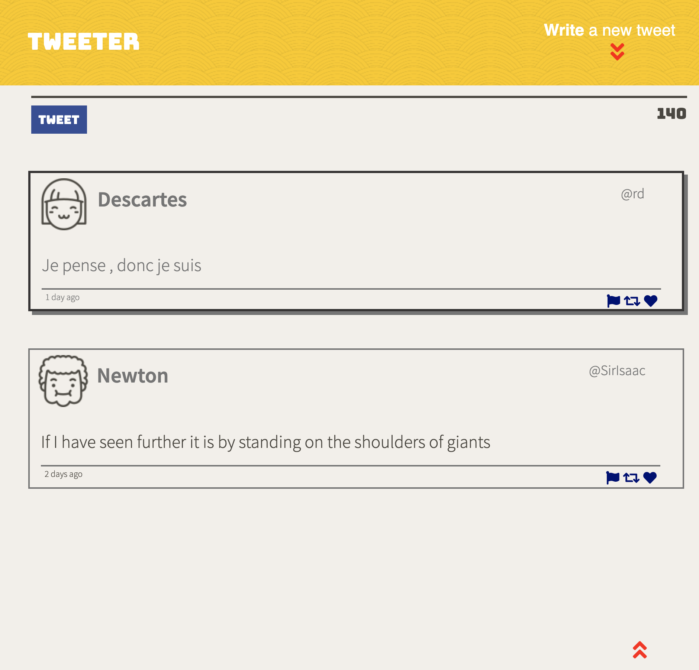

# Tweeter Project

Tweeter is a simple, single-page Twitter clone. It communicates with a server via AJAX.

## Dependencies

- Express
- Chance
- body-parser
- md5
- nodemon
- Node 5.10.x or above

## Getting Started
1. Install dependencies using the `npm install` command.
2. Start the web server using the `npm run local` command. The app will be served at <http://localhost:8080/>.
3. Go to <http://localhost:8080/> in your browser.

## Final Product
*Screen size less than 1024px*

*screen size min-width 1024px*

*Blank input*

*Tweet exceeds limit of 140 characters*

*Hover effect and scroll to top button*

